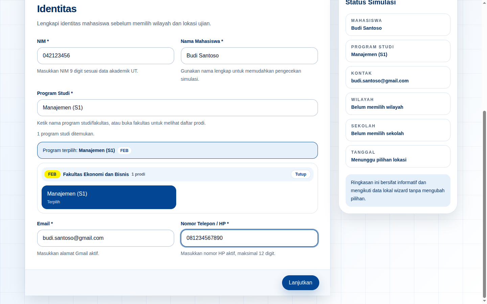
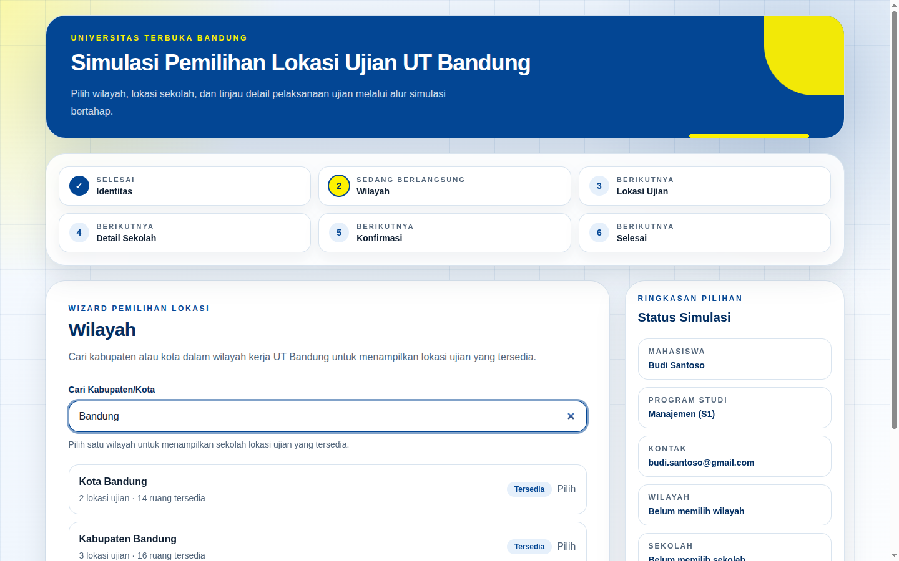
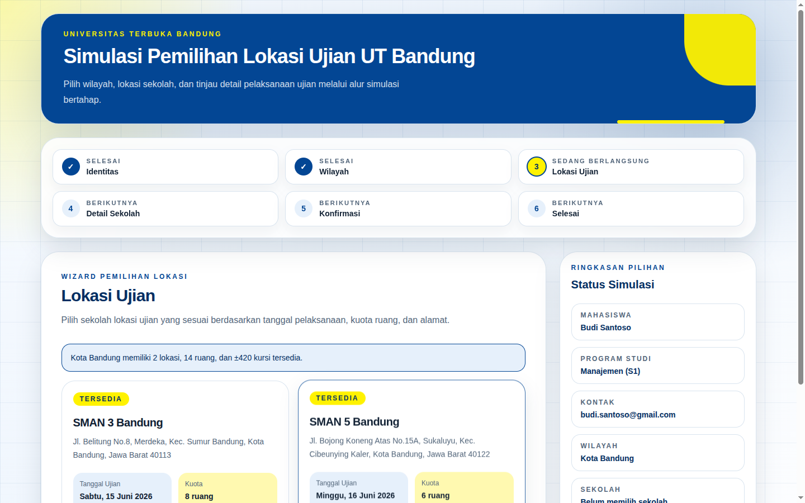
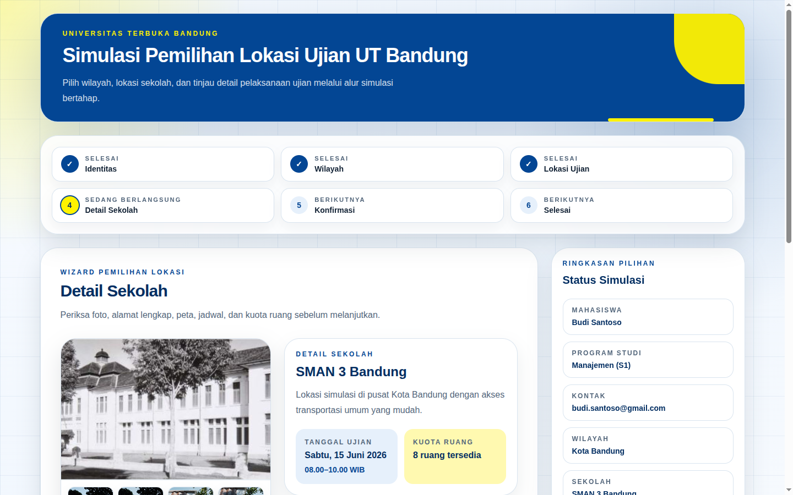
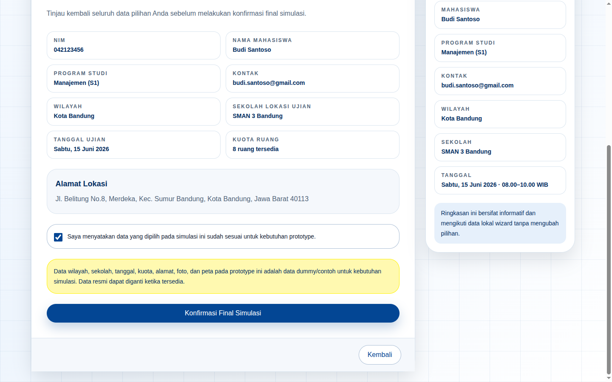
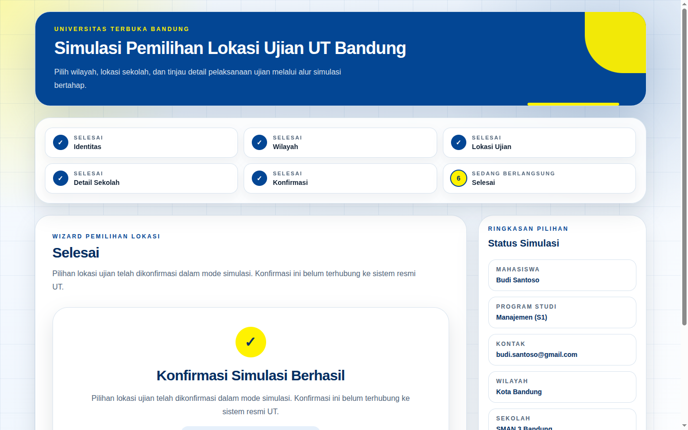

# Simulasi Pemilihan Lokasi Ujian UT Bandung

<p align="center">
  
</p>

<p align="center">
  
  
  
  
</p>

<p align="center"><em>Prototype simulasi alur pemilihan lokasi ujian untuk mahasiswa Universitas Terbuka Bandung.</em></p>

## Tentang

Aplikasi ini adalah **prototype frontend** yang mensimulasikan alur mahasiswa Universitas Terbuka Bandung dalam memilih lokasi ujian: dari formulir identitas, pencarian kabupaten/kota, pemilihan sekolah lokasi ujian, detail sekolah, hingga konfirmasi final dan layar sukses.

> **Catatan status**: Project ini hanya membangun sisi frontend dengan data dummy statis lokal. Tidak ada backend, database, autentikasi, admin panel, mutasi kuota, notifikasi, atau integrasi data resmi UT. Data wilayah, sekolah, tanggal, kuota, alamat, foto, dan peta bersifat contoh untuk kebutuhan simulasi.

## Fitur

- **Formulir identitas** — NIM 9 digit, nama, pencarian program studi per fakultas (47+ prodi), email Gmail, nomor HP.
- **Pencarian wilayah** — cari kabupaten/kota dalam wilayah kerja UT Bandung, lengkap dengan status ketersediaan kuota.
- **Daftar lokasi ujian** — kartu sekolah dengan tanggal, kuota ruang, dan estimasi kursi; lokasi penuh otomatis nonaktif.
- **Detail sekolah** — galeri foto dengan lightbox (navigasi keyboard), alamat, jadwal, kuota, dan pratinjau peta OpenStreetMap.
- **Review & konfirmasi** — ringkasan seluruh pilihan, pernyataan konfirmasi, dan modal konfirmasi final.
- **Layar sukses** — ringkasan akhir dengan tombol untuk mengulang simulasi.
- **Aksesibel** — `aria-live`, `aria-invalid`, navigasi keyboard, `prefers-reduced-motion`, dan skip link.
- **Responsif** — sidebar ringkasan di desktop, header langkah ringkas di mobile.

## Tampilan

| | |
|---|---|
|  |  |
| Langkah 1 — Identitas mahasiswa | Langkah 2 — Pencarian kabupaten/kota |

| | |
|---|---|
|  |  |
| Langkah 3 — Daftar lokasi ujian | Langkah 4 — Detail sekolah dan peta |

| | |
|---|---|
|  |  |
| Langkah 5 — Review dan konfirmasi | Langkah 6 — Konfirmasi berhasil |

## Teknologi

| Layer | Teknologi |
|-------|-----------|
| UI | React 19 |
| Build tool | Vite 7 |
| Bahasa | TypeScript 5.8 |
| Styling | Tailwind CSS 4 |
| State | `useReducer` + pure functions (tanpa library eksternal) |
| Peta | Embed OpenStreetMap (tanpa API key) |

## Struktur Proyek

```
src/
├── main.tsx              # entry React
├── App.tsx               # orkestrasi wizard: useReducer + switch step
├── components/
│   ├── steps/            # 6 langkah wizard
│   ├── layout/           # AppShell, WizardFrame, SelectionSummary, MobileStepHeader
│   ├── location/         # LocationCard, MapPreview
│   └── ui/               # Button, FormField, Stepper, SummaryItem
├── content/              # copy.ts (semua teks UI), brand.ts (warna UT)
├── data/                 # examLocations.ts, programStudies.ts (data dummy)
├── state/                # wizardReducer.ts, validation.ts (pure functions)
├── styles/               # theme.css (design tokens)
├── types/                # wizard.ts, location.ts
└── utils/                # cx.ts, quota.ts
public/                   # favicon, logo, foto sekolah dummy
docs/screenshots/         # tangkapan layar alur wizard
```

## Persyaratan

- Node.js 20.19+ atau 22.12+ (Vite 7). Versi referensi: Node 24 (lihat `.nvmrc`).
- npm 10+.

## Instalasi Lokal

1. Clone repositori:

   ```bash
   git clone https://github.com/mifdlaldev/simulasi-lokasi-ujian-ut-bandung.git
   cd simulasi-lokasi-ujian-ut-bandung
   ```

2. Install dependency:

   ```bash
   npm install
   ```

3. Jalankan server development:

   ```bash
   npm run dev
   ```

4. Buka `http://127.0.0.1:5173` di browser.

## Skrip Tersedia

| Perintah | Deskripsi |
|----------|-----------|
| `npm run dev` | Jalankan server development (host `127.0.0.1`) |
| `npm run build` | Build versi produksi ke `dist/` |
| `npm run preview` | Preview hasil build secara lokal |

## Data Dummy

Data wilayah dan sekolah lokasi ujian berada di `src/data/examLocations.ts`:

1. Ubah daftar `examRegions` untuk wilayah kabupaten/kota.
2. Ubah daftar `examLocations` untuk sekolah lokasi ujian.
3. Pastikan `regionId` pada setiap lokasi sesuai dengan `id` wilayah.
4. Gunakan `photoUrl` lokal di `public/` atau URL gambar stabil.
5. `mapUrl` berupa tautan peta biasa; tidak diperlukan API key.

## Pedoman untuk Agen AI

Repo ini memakai **AGENTS.md** sebagai pedoman wajib bagi agen AI sebelum mengerjakan kode di repo ini.

**Aturan utama: AI DILARANG HALUSINASI.** Ringkasan:

- Setiap klaim tentang kode/data/fitur wajib berdasar pembacaan file aktual. Dilarang menebak atau mengarang.
- Dilarang mengklaim fitur yang tidak ada di codebase (backend, database, autentikasi, admin panel, mutasi kuota, integrasi resmi UT — semuanya **tidak ada**).
- Dilarang mengklaim build/test lulus tanpa benar-benar menjalankan `npm run build`.
- Dilarang mengarang hasil verifikasi atau catatan evidence.
- Dilarang menambah dependency/integrasi eksternal tanpa konfirmasi user.
- Jika tidak yakin → baca file. Jika tidak ada → nyatakan "tidak ada / tidak ditemukan di codebase".

Baca `AGENTS.md` untuk aturan lengkap, peta struktur, konvensi, dan anti-pattern proyek ini.

## Lisensi

Didistribusikan di bawah lisensi [Apache License 2.0](LICENSE). Logo dan aset visual Universitas Terbuka adalah milik instansinya masing-masing dan tidak tercakup dalam lisensi ini.
